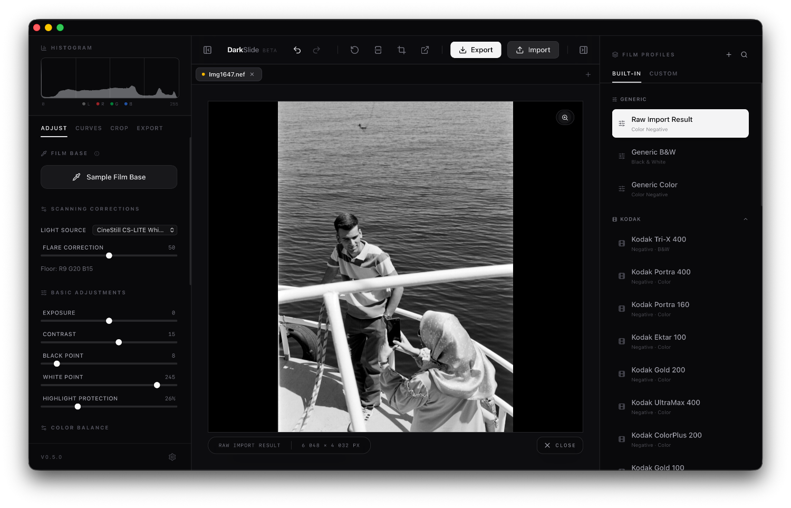

# DarkSlide

<div align="center">
  <p>Turn your film negatives into beautiful positives — right in your browser or as a desktop app.</p>
  <p><strong><a href="https://darkslide.vercel.app">Try the live demo →</a></strong> — no install required</p>
  
</div>

## What is DarkSlide?

DarkSlide is a free, open-source tool for converting scanned film negatives into positive images. Whether you shoot 35mm, 120, or large format — just scan your negatives, drop them into DarkSlide, and start editing. No subscription, no cloud upload, everything stays on your machine.

## What's New in v0.6.0

- **Roll management** — group frames into rolls, name them with film stock info, and browse them in a filmstrip panel inside the sidebar
- **Scanning sessions** — open a dedicated session window that watches a folder and imports new frames automatically as your scanner writes them
- **Expanded film profile library** — 15 new built-in profiles including Ektachrome E100, Kodak Double-X 5222, Fujifilm 200, Astia 100F, XP2 Super, Delta 100/400, SFX 200, Fomapan 100/200/400, and Rollei RPX 25/100/400
- **Preset folders** — organize custom presets into named, collapsible folders; move presets between them via the hover menu
- **Film stock autocomplete** — the film stock field suggests names from built-in profiles, your custom presets, and your history
- **Preset sorting** — sort by last added, color/B&W, RAW/non-RAW, or film stock
- **Preset detail expansion** — click a preset to see its scanner, light source, lab style, and tags at a glance
- **Default export folders** — set separate output paths for editor saves, batch exports, and contact sheets in Settings
- **Auto-update banner** — the desktop app notifies you when a new version is available
- **IndexedDB preset storage** — presets now survive storage limits that affected localStorage

## Features

### Convert & Edit
- **Instant negative-to-positive conversion** with real-time preview
- **Film stock profiles** — 40+ built-in color and black & white stocks to match the look of popular films
- **Full editing controls** — exposure, contrast, saturation, temperature, tint, curves, black & white points, and highlight protection
- **Black & white mode** with per-channel luminance mixing for fine-tuned tonal control
- **Sharpening & noise reduction** to clean up your scans

### Organize & Export
- **Roll management** — group frames into rolls with film stock metadata and a sidebar filmstrip
- **Scanning sessions** — live folder watch that imports frames as your scanner writes them (desktop only)
- **Work on multiple images at once** with tabbed documents
- **Batch export** — convert a whole roll with one click, optionally applying a preset to every frame
- **Contact sheet generation** — create a grid overview of your scans
- **Save and share presets** — create custom looks, organize them in folders, and export/import as `.darkslide` files
- **Searchable preset browser** with sorting and tag display

### Crop & Compose
- **Non-destructive crop** with common film format ratios (3:2, 4:5, 1:1, 6x7, etc.)
- **Zoom & pan** for checking fine details
- **Before/after comparison** to see your edits side by side
- **Live histogram** with per-channel display

### Desktop App
- **RAW file support** — open DNG, CR3, NEF, ARW, RAF, and RW2 files directly (desktop only)
- **Native file dialogs** for a smoother experience
- **Open in external editor** — send your image to Photoshop, Affinity Photo, or any other app
- **Auto-update notifications** — get notified when a new version is available

**macOS** builds are universal binaries — native on both Apple Silicon and Intel Macs.

**Windows & Linux** experimental builds are available starting with v0.6.0. Unsigned and not yet production-tested — feedback welcome.

> DarkSlide also works entirely in the browser — no install needed. The desktop app adds RAW support, scanning sessions, and native OS integration.

## macOS Installation Note

Pre-built macOS binaries are currently **not notarized**. macOS will block the app on first launch:

1. Download and move the app to your Applications folder.
2. Try to open it — macOS will show a security warning.
3. Go to **System Settings → Privacy & Security** and click **"Open Anyway"**.
4. Confirm the dialog. It will open normally from then on.

> This only needs to be done once.

## Getting Started

### Install the desktop app

Download the latest `.dmg` installer from the [Releases](https://github.com/kilianvivien/DarkSlide/releases) page — no build step required.

### Run from source (browser)


```bash
git clone https://github.com/kilianvivien/DarkSlide.git
cd DarkSlide
npm install
npm run dev
```

### Run the desktop app

Requires [Rust & Cargo](https://rustup.rs/) in addition to Node.js.

```bash
npm run tauri:dev
```

### Build for production

```bash
npm run build          # web app → dist/
npm run tauri:build    # desktop app
```

## Tech Stack

- **Frontend:** React 19, Vite, Tailwind CSS v4, TypeScript
- **Desktop:** Tauri (Rust)
- **Image Processing:** Web Workers, WebGPU (with CPU fallback), UTIF, rawler
- **UI:** Lucide icons, Framer Motion

## 🙏 Acknowledgements

DarkSlide is built on top of some amazing open-source projects:

| Library | License | Description |
|---|---|---|
| [React](https://react.dev/) | MIT | UI library |
| [Tauri](https://tauri.app/) | MIT / Apache-2.0 | Desktop application framework |
| [Vite](https://vitejs.dev/) | MIT | Frontend build tooling |
| [Tailwind CSS](https://tailwindcss.com/) | MIT | Utility-first CSS framework |
| [Lucide](https://lucide.dev/) | ISC | Icon toolkit |
| [Framer Motion](https://www.framer.com/motion/) | MIT | Animation library for React |
| [UTIF.js](https://github.com/photopea/UTIF.js) | MIT | Fast TIFF decoder |
| [rawler](https://github.com/dnglab/dnglab) | LGPL-2.1 | Pure-Rust RAW image decoder |

## 📜 License

This project is licensed under the MIT License - see the [`LICENSE`](./LICENSE) file for details.
