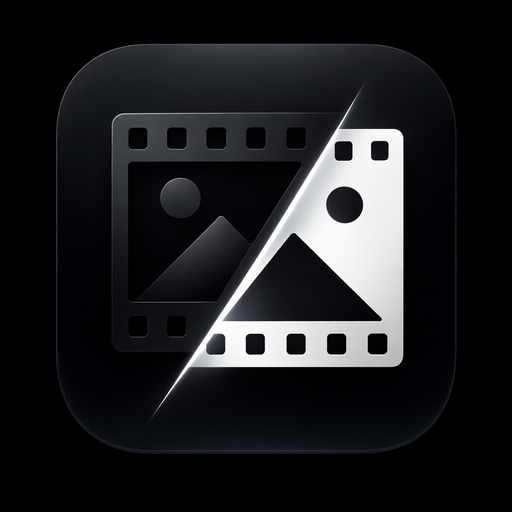

<div align="center">
  
  <h1>DarkSlide</h1>
  <p><strong>Bring your film negatives to life.</strong></p>
  <p>A free, open-source negative converter for your browser and desktop.<br />From a single scan to a whole roll — develop, repair, and export locally.</p>
  <p><strong><a href="https://darkslide.vercel.app">Try the web app →</a></strong> &nbsp; · &nbsp; <strong><a href="https://github.com/kilianvivien/DarkSlide/releases/latest">Download for desktop →</a></strong></p>
  <p><a href="#features">Features</a> · <a href="#get-started">Get started</a> · <a href="#run-from-source">Run from source</a></p>
  <br />
  
  <p><sub>The DarkSlide editor: your image, development tools, and filmstrip in one workspace.</sub></p>
</div>

DarkSlide turns scanned **color and black & white film negatives** into positive images. Whether you shoot 35mm, 120, or large format, you can refine the conversion with film profiles and editing tools, repair dust and scratches, and export finished images or contact sheets.

Edits are non-destructive, and image processing stays on your machine. **No subscription. No cloud upload.**

## Features

### Develop your scans

- **Live negative-to-positive conversion** — choose a film stock profile, sample the film base, and see adjustments immediately.
- **Color and tonal controls** — exposure in real stops, contrast, black and white points, highlight protection, saturation, temperature, and tint. Auto white balance offers a quick starting point.
- **Precise curves** — shape individual channels or the overall tone with draggable points, fine adjustments, and exact input/output values.
- **Black & white conversion** — use dedicated film profiles or per-channel luminance mixing to control tonal separation.
- **Scanning corrections** — film-base compensation, light-source settings, and lab styles help tailor the conversion to your scan.
- **Reusable looks** — save custom presets, organize them in folders, and share them as `.darkslide` files. Import `.cube` LUTs for conversion or export a preset as a LUT for other editing tools.

### Frame, inspect, and repair

- **Non-destructive crop and straighten** — common film ratios, edge and corner handles, ratio lock, and reference-line leveling.
- **Automatic frame detection** — find the image gate inside film rebates and sprocket holes, then stabilize crop sizes across a roll.
- **Dust, hair, and scratch repair** — paint over defects manually or review automatic detection marks before applying repairs. Automatic detection is **in beta**.
- **Finishing tools** — sharpening and noise reduction, cursor-anchored zoom and pan, and before/after comparison.
- **Live histogram** — inspect channels, luminance percentiles, clipping warnings, and a logarithmic view while editing.

### Work through a roll and export

- **Filmstrip workflow** — import several files or a folder, browse numbered frame thumbnails, and select multiple frames. Folder groups keep related scans together.
- **Sync selected frames** — share a look or film base across a roll while preserving each frame's crop and repairs. Add film stock metadata from Roll Info.
- **Flexible exports** — export the current frame, a selection, or all open frames with their individual edits. Save JPEG, WebP, PNG, or TIFF, including 16-bit PNG and TIFF output.
- **Batch conversion** — apply one shared recipe to files you haven't opened using **File → Convert Files**.
- **Contact sheets** — build a grid from open frames or unopened files, with a live preview before export.

## Browser or desktop

| | Browser | Desktop |
|---|---|---|
| Import scans | TIFF, JPEG, PNG, WebP | The same formats, plus DNG, CR3, NEF, ARW, RAF, and RW2 RAW camera scans |
| Editing and output | Conversion, presets, crop, repairs, batch export, contact sheets | The same editing tools and export options |
| Integration | Runs directly in your browser | Native file dialogs, external-editor integration, and update notifications |

The desktop app converts RAW negatives in the camera's own color space. macOS builds run natively on Apple Silicon and Intel; Windows and Linux builds are experimental.

## Get started

[Open DarkSlide in your browser](https://darkslide.vercel.app), or choose an installer from the [latest desktop release](https://github.com/kilianvivien/DarkSlide/releases/latest).

| Platform | Installer | Status |
|---|---|---|
| macOS | Universal `.dmg` | Apple Silicon and Intel; not notarized |
| Windows | `.msi` or `.exe` | Experimental, unsigned |
| Linux | `.deb` or `.AppImage` | Experimental |

Windows and Linux builds are not yet production-tested; feedback is welcome.

**Your first conversion:**

1. **Import** a scan or folder and select a frame in the filmstrip.
2. **Develop** it with a film profile and film-base sample, then adjust color, tone, crop, and any repairs.
3. **Export** the finished frame, sync the look to other frames, or create a contact sheet.

### First launch on macOS

Pre-built macOS binaries are not notarized. To open the app:

1. Move DarkSlide to your **Applications** folder and try opening it once.
2. Go to **System Settings → Privacy & Security** and click **Open Anyway**.
3. Confirm the dialog. This only needs to be done once.

## Latest release — v1.3.1

This release improves camera-scan calibration, performance, and TIFF conversion:

- **RAW flat-field calibration** corrects uneven illumination and lens vignetting; clipped film-base warnings help catch capture problems.
- **Faster RAW decode and Rust processing**, with fewer memory copies and reusable previews for smoother editing.
- **Display P3 TIFF corrections** prevent color clipping before inversion and improve automatic film-base safety.
- **More efficient exports**, including compressed 16-bit PNG and lower-memory TIFF output.

Read the [full v1.3.1 release notes](https://github.com/kilianvivien/DarkSlide/releases/tag/v1.3.1).

## Run from source

Requires Node.js 20.19+ or 22.12+ (CI uses Node 24). Desktop development also requires [Rust & Cargo](https://rustup.rs/), version 1.90 or newer.

```bash
git clone https://github.com/kilianvivien/DarkSlide.git
cd DarkSlide
npm install
npm run dev           # browser app on http://localhost:3000
```

For the desktop app:

```bash
npm run tauri:dev
```

Build and validate:

```bash
npm run build         # web production build → dist/
npm run tauri:build   # desktop production build
npm run typecheck
npm run lint
npm run test
```

**Stack:** React 19, TypeScript, Vite, Tailwind CSS, and Tauri. Image processing runs in Web Workers with WebGPU acceleration and Rust WebAssembly kernels, with a TypeScript fallback; UTIF.js and rawler handle TIFF and RAW decoding. See [PERFORMANCE.md](./PERFORMANCE.md) for measurements and kernel build instructions.

## Acknowledgements

Thanks to [tdurieux](https://github.com/tdurieux), whose fork contributed ideas and code for the editor redesign, crop and straighten tools, histogram, RAW imports, and color-accuracy tooling, and to the open-source projects that power DarkSlide:

| Project | License |
|---|---|
| [React](https://react.dev/), [Vite](https://vitejs.dev/), [Tailwind CSS](https://tailwindcss.com/), [Motion](https://motion.dev/), [UTIF.js](https://github.com/photopea/UTIF.js) | MIT |
| [Tauri](https://tauri.app/) | MIT / Apache-2.0 |
| [Lucide](https://lucide.dev/) | ISC |
| [rawler](https://github.com/dnglab/dnglab) | LGPL-2.1 |

The 126-format test image in [evaluation/online-samples](./evaluation/online-samples/README.md) is derived from a Wikimedia Commons photograph by Bigbear213 and licensed separately under CC BY-SA 4.0.

## License

DarkSlide is licensed under [MIT](./LICENSE).
