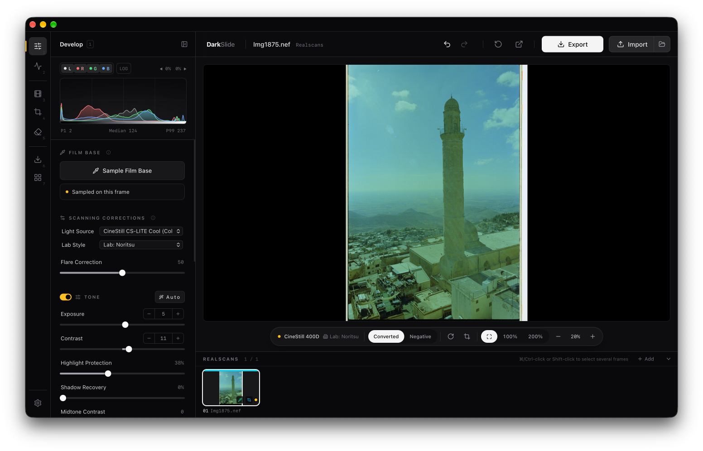

# DarkSlide

<div align="center">
  <p>Turn your film negatives into beautiful positives — right in your browser or as a desktop app.</p>
  <p><strong><a href="https://darkslide.vercel.app">Try the live demo →</a></strong> — no install required</p>
  <p><a href="https://github.com/kilianvivien/DarkSlide/releases/tag/v1.3.0">Download DarkSlide 1.3.0 for macOS, Windows, or Linux</a></p>
  
</div>

## What is DarkSlide?

DarkSlide is a free, open-source tool for converting scanned film negatives into positive images. Whether you shoot 35mm, 120, or large format — just scan your negatives, drop them into DarkSlide, and start editing. No subscription, no cloud upload, everything stays on your machine.

## What's New in v1.3.0

A redesigned editor built around rolls of film, using ideas from Durieux's ([@tdurieux](https://github.com/tdurieux)) fork.

- **Tool rail and one inspector** — Develop, Curves, Film profiles, Crop, Dust and Export open in a single panel from a rail on the left (shortcuts 1–6); film profiles no longer need their own side panel
- **Filmstrip** — open frames appear as numbered thumbnails with film-base, crop and unsaved-edit status; use ← and → to move between them
- **Multi-frame selection** — ⌘/Ctrl- or Shift-click frames to sync the current look to them (each keeps its own crop and repairs), stabilize their crops, or export them
- **Export frames with their own edits** — the Export panel exports this frame, the selection or every open frame, each with its own look and file name
- **Switchable adjustment groups** — turn Tone, Range, White Balance or Color off to compare, without losing their values
- **Image toolbar** — converted/negative comparison, rotate, crop and zoom in one floating toolbar

See the [full v1.3.0 release notes](https://github.com/kilianvivien/DarkSlide/releases/tag/v1.3.0).

### Earlier in v1.2.4

DarkSlide 1.2.4 brings in the best ideas from [tdurieux](https://github.com/tdurieux)'s fork, reworked to fit DarkSlide's existing editor and conversion pipeline.

- **Smarter auto crop** — portrait scans, film rebates, sprocket holes, and square (126, 6×6) or medium-format gates are recognized, and crops now land in the right place on rotated and EXIF-rotated scans
- **Stabilize a roll's crops** — one action on the roll card shares a robust crop size across frames scanned at the same size, keeps each frame's position, leaves manual crops alone unless you include them, and can be undone per frame
- **Better crop and straighten tools** — edge handles, Shift to keep the ratio, arrow-key nudging, and drawing a line along a horizon or vertical edge to level the image
- **Fine adjustment buttons** — −/+ steppers on key sliders for exact values, each click a single undo step
- **A more informative histogram** — channel toggles, luminance percentiles, per-channel clipping warnings, and an optional logarithmic scale
- **Zoom that follows the cursor** — wheel and pinch zoom start from the fitted view and keep the point under the cursor in place
- **Faster RAW imports** — decoded RAW pixels move from the native decoder to the editor as compact binary data, decoded off the main thread; opening many scans for a batch no longer loads them all into memory first
- **Color-accuracy tooling** — a CIEDE2000 evaluator for measured chart captures, so accuracy changes can be checked against real targets

See the [v1.2.4 release notes](https://github.com/kilianvivien/DarkSlide/releases/tag/v1.2.4).

### Earlier in v1.2.3

- **More reliable exports** — previews wait while exports and contact sheets finish, and delayed worker requests no longer interrupt a healthy export
- **Presets that preserve your look** — saved presets retain film-stock calibration, color conversion, LUTs, light-source settings, and lab style; saving leaves your active image and unsaved edits intact
- **Repairs stay with the image** — reusable presets exclude dust-repair coordinates, and presets saved without framing preserve the target image's crop, rotation, and leveling
- **More consistent conversions** — CPU rendering, GPU previews, and high-depth exports share precise curve tables; film-base references retain their color profile, and RAW import avoids applying film-base color compensation twice
- **More accurate white balance** — automatic analysis and the grey picker use the converted image and matching slider math, including lab-style temperature bias and over-range channel samples
- **Edits protected during analysis** — stale auto-adjustment, film-base re-analysis, and picker results are discarded; sidecar restoration respects saved profiles and explicitly disabled light-source or lab-style selections

See the [v1.2.3 release notes](https://github.com/kilianvivien/DarkSlide/releases/tag/v1.2.3). That release also included the export reliability fixes from the unreleased v1.2.2 version.

### Earlier in v1.2.0

- **Import `.cube` LUTs as presets** — drop a 3D LUT on the Custom tab (or pick it through Import) and it becomes a custom preset. The LUT performs the negative→positive conversion in place of DarkSlide's own inversion, and every slider still applies on top of it
- **Export any preset as a `.cube` LUT** — bake a preset's full conversion into a 33×33×33 LUT that turns a raw negative scan into a finished positive in Resolve, Premiere, or anything else that reads `.cube`
- **LUT presets are marked throughout** — a distinct icon in the browser, a `3D LUT` tag with the table size, and a `(LUT)` marker on the preview status bar

### Earlier in v1.1.0

- **True 16-bit export fidelity** — high-bit-depth exports now keep float precision through curves, sharpening, and noise reduction, avoiding the intermediate 8-bit rounding that could quantize smooth tones
- **Auto White Balance** — a new one-click control neutralizes color casts by applying temperature and tint from DarkSlide's neutral-balance analysis
- **Better results for borderless scans** — when no film rebate is visible, DarkSlide can estimate the film base from the brightest low-texture area inside the frame and records the estimate as low-confidence for transparency
- **Security hardening** — all fixable npm and Cargo dependency alerts have been addressed, including the Tauri origin-confusion fix, while staying within the project's current major versions

### Earlier in v1.0.0

- **Density-domain inversion** — negatives are now inverted in the film-density domain, with the base sample driving an exact black point and flare subtracted symmetrically from the base and the image, for more faithful, better-behaved conversions
- **Deterministic, inspectable conversions** — per-document residual-base and highlight analysis are pinned so the preview and the export match, and a diagnostic report captures the exact conversion parameters used
- **Parsed ICC input profiles** — embedded matrix+TRC ICC profiles are read directly (with D50→D65 adaptation), instead of always falling back to sRGB
- **Bit-depth export controls** — added a bit-depth choice for PNG and TIFF exports, with real deflate compression for 8-bit PNG; full 16-bit processing followed in v1.1.0
- **Consistent batch pipeline** — batch export now makes the color-vs-mono decision the same way as preview and single export, so a B&W-toggled color negative no longer slips down the wrong pipeline
- **Correct embedded PNG color profiles** — fixed the zlib framing in embedded PNG ICC profiles so the profile round-trips in other applications

### Earlier in v0.9.3

- **Fixed RAW black & white conversions** — mono RAW renders and exports no longer inherit a color negative's film-base correction, fixing washed-out and color-cast results when converting RAW negatives with a B&W profile (or with the B&W toggle enabled)
- **Consistent color-vs-mono pipeline** — the decision of whether a frame is processed in color or monochrome is now made the same way across preview, auto-analyze, single export, batch export, and contact sheets, so a frame can no longer slip down the wrong pipeline

### Earlier in v0.9.2

- **New manufacturer-backed film stocks** — added presets for Kodak Ektacolor/Ektapan, Kodak Vision3, Kodak Verita, Ilford Ortho Plus, Kentmere Pan 100, Harman Phoenix/Red/Switch Azure, Lomography LomoChrome/Redscale/Kino stocks, and CineStill BwXX

### Earlier in v0.9.1

- **Fixed a crash when opening files via the macOS dock** before the app had finished loading

### Earlier in v0.9.0

- **Auto dust/hair/scratch removal — major overhaul**
  - **Full-length hair coverage** — the inpainter now measures each defect's width along its path and covers the full visible width, instead of leaving thin residual streaks along long hairs and scratches
  - **Grain-preserving repair** — path repairs now copy texture from a parallel donor strip (structure + texture decomposition), so film grain stays intact instead of getting replaced by a blurred patch
  - **Fewer false positives on grainy scans** — new texture vetoes (per-component noise-floor check + stricter peak isolation on the fallback detector) keep grain-only "peaks" from being flagged as dust
  - **Better faint and curved scratch detection** — a Hessian-based line-likeness map complements the orientation filter for low-contrast and non-straight defects
- **Polish & reliability**
  - **Visible error toasts** — image worker failures, import errors, and export failures now surface as bottom-right toasts with a copy-able diagnostic ID, instead of disappearing silently into the diagnostics log
  - **Color-profile safety** — exports now abort loudly with a clear error if an ICC profile is malformed or a transform can't be built, rather than silently producing a color-corrupt file with the wrong embedded profile
  - **Modal accessibility** — every modal (Settings, Batch, Contact Sheet, Roll Info) now closes with Escape, identifies itself to screen readers as a `dialog`, and only the topmost modal consumes Escape so nested dialogs stack correctly

### Earlier in v0.8.3

- **Corrected 6×4.5 crop preset** — the medium-format 6×4.5 preset now uses the nominal 6 cm × 4.5 cm frame ratio in both landscape and portrait orientations

### Earlier in v0.8.2

- **RAW import fixes** — fixed a startup crash when opening RAW files before any image was loaded, and duplicate tab creation on import
- **Fixed preset auto-apply on RAW imports** — presets now apply correctly on RAW files, with import settings propagating as expected
- **Removed flat-field correction** — the feature added complexity with no meaningful real-world benefit
- **Removed H&D inversion pipeline** — simplifies the conversion pipeline and removes an under-used code path

### Earlier in v0.8.0

- **Film base preserved on profile switch** — switching film stock profiles no longer discards the scan's film base sample or resets the inversion method, so colors stay consistent as you browse profiles
- **Improved density balance and base correction** — profile-based density balance is more accurate, especially for RAW imports with per-channel base estimation
- **Redesigned Dust pane** — cleaner layout with improved repair quality
- **Better dust & hair detection** — auto-marking is more reliable and visible in the viewer

## Features

### Convert & Edit
- **Instant negative-to-positive conversion** with real-time preview
- **Film stock profiles** — 40+ built-in color and black & white stocks to match the look of popular films
- **Convert with a `.cube` LUT** — import a 3D LUT and it handles the negative-to-positive conversion in place of DarkSlide's own inversion, with every slider still available on top
- **Full editing controls** — exposure, contrast, saturation, temperature, tint, curves, black & white points, and highlight protection
- **Auto White Balance** — neutralize color casts in one click while retaining full control over temperature and tint
- **Black & white mode** with per-channel luminance mixing for fine-tuned tonal control
- **Sharpening & noise reduction** to clean up your scans

### Organize & Export
- **Roll management** — group frames into rolls with film stock metadata, sync settings or the film base across a roll, and stabilize crops
- **Scanning sessions** — live folder watch that imports frames as your scanner writes them (desktop only)
- **Filmstrip** — all open frames with status at a glance; select several to sync their look, stabilize crops or export them together
- **Export frames** — export the current frame, a selection or every open frame, each with its own edits
- **Convert files** — apply one shared recipe to scans you haven't opened
- **Contact sheet generation** — create a grid overview of your scans
- **High-bit-depth output** — export 16-bit PNG or TIFF files with float precision preserved through curves, sharpening, and noise reduction
- **Save and share presets** — create custom looks with film-stock calibration, light-source settings, and lab style; organize them in folders and export/import as `.darkslide` files
- **3D LUT interchange** — import `.cube` LUTs as presets and bake any preset back out to `.cube`
- **Searchable preset browser** with sorting and tag display

### Dust & Scratch Removal
- **Manual repair** — paint over dust spots, hairs, and scratches; DarkSlide fills them in using surrounding pixels
- **Auto-detect mode** — automatically marks likely defects across the image so you can review and remove them in one step *(experimental — results may vary depending on scan quality and film type)*

### Crop & Compose
- **Non-destructive crop** with common film format ratios (3:2, 4:5, 1:1, 6x7, etc.), edge and corner handles, and ratio lock
- **Auto crop** that finds the image gate inside rebates and sprocket holes, plus roll-wide crop stabilization
- **Straighten** with a level slider or by drawing along a reference line
- **Zoom & pan** anchored to the cursor for checking fine details
- **Before/after comparison** to see your edits side by side
- **Live histogram** with channel toggles, percentiles, and clipping warnings

### Desktop App
- **RAW file support** — open DNG, CR3, NEF, ARW, RAF, and RW2 files directly (desktop only)
- **Native file dialogs** for a smoother experience
- **Open in external editor** — send your image to Photoshop, Affinity Photo, or any other app
- **Auto-update notifications** — get notified when a new version is available

**macOS** builds are universal binaries — native on both Apple Silicon and Intel Macs.

**Windows & Linux** experimental builds are available starting with v0.6.0. Unsigned and not yet production-tested — feedback welcome.

> DarkSlide also works entirely in the browser — no install needed. The desktop app adds RAW support, scanning sessions, and native OS integration.

## macOS Installation Note

Pre-built macOS binaries are currently **not notarized**. macOS will block the app on first launch:

1. Download and move the app to your Applications folder.
2. Try to open it — macOS will show a security warning.
3. Go to **System Settings → Privacy & Security** and click **"Open Anyway"**.
4. Confirm the dialog. It will open normally from then on.

> This only needs to be done once.

## Getting Started

### Install the desktop app

Download an installer from the [DarkSlide v1.3.0 release](https://github.com/kilianvivien/DarkSlide/releases/tag/v1.3.0) — no build step required:

- **macOS:** universal `.dmg` for Apple Silicon and Intel Macs
- **Windows:** `.msi` or NSIS `.exe`
- **Linux:** `.deb` or `.AppImage`

Installers are attached automatically as the release builds finish. For future versions, check the [latest release](https://github.com/kilianvivien/DarkSlide/releases/latest).

### Run from source (browser)


```bash
git clone https://github.com/kilianvivien/DarkSlide.git
cd DarkSlide
npm install
npm run dev
```

### Run the desktop app

Requires [Rust & Cargo](https://rustup.rs/) in addition to Node.js.

```bash
npm run tauri:dev
```

### Build for production

```bash
npm run build          # web app → dist/
npm run tauri:build    # desktop app
```

## Tech Stack

- **Frontend:** React 19, Vite, Tailwind CSS v4, TypeScript
- **Desktop:** Tauri (Rust)
- **Image Processing:** Web Workers, WebGPU (with CPU fallback), UTIF, rawler
- **UI:** Lucide icons, Framer Motion

## 🙏 Acknowledgements

DarkSlide is built on top of some amazing open-source projects:

| Library | License | Description |
|---|---|---|
| [React](https://react.dev/) | MIT | UI library |
| [Tauri](https://tauri.app/) | MIT / Apache-2.0 | Desktop application framework |
| [Vite](https://vitejs.dev/) | MIT | Frontend build tooling |
| [Tailwind CSS](https://tailwindcss.com/) | MIT | Utility-first CSS framework |
| [Lucide](https://lucide.dev/) | ISC | Icon toolkit |
| [Framer Motion](https://www.framer.com/motion/) | MIT | Animation library for React |
| [UTIF.js](https://github.com/photopea/UTIF.js) | MIT | Fast TIFF decoder |
| [rawler](https://github.com/dnglab/dnglab) | LGPL-2.1 | Pure-Rust RAW image decoder |

Thanks to [tdurieux](https://github.com/tdurieux), whose DarkSlide fork contributed the ideas and much of the code behind 1.2.4's frame detection, crop and straighten tools, fine adjustment buttons, histogram analysis, cursor-anchored zoom, render cancellation, lazy imports, binary RAW transport, and color-accuracy evaluator.

The 126-format test image in [`evaluation/online-samples`](./evaluation/online-samples/README.md) is derived from a Wikimedia Commons photograph by Bigbear213 and is licensed under CC BY-SA 4.0, separately from DarkSlide's MIT license.

## 📜 License

This project is licensed under the MIT License - see the [`LICENSE`](./LICENSE) file for details.
