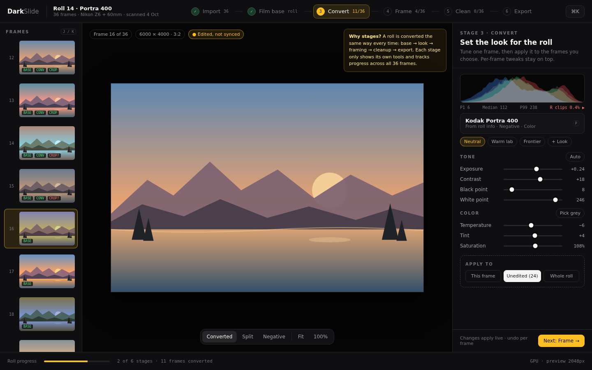
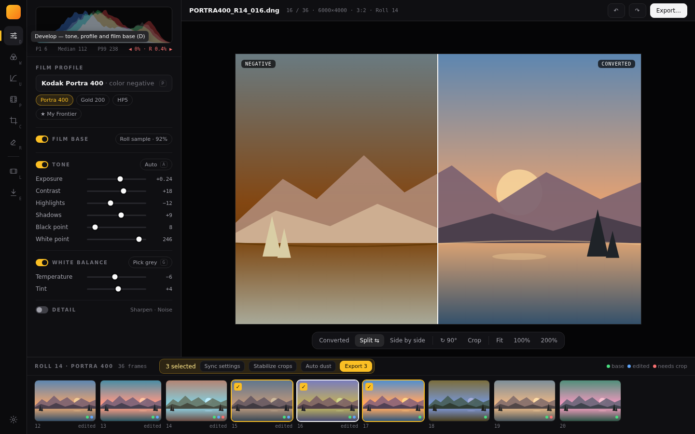
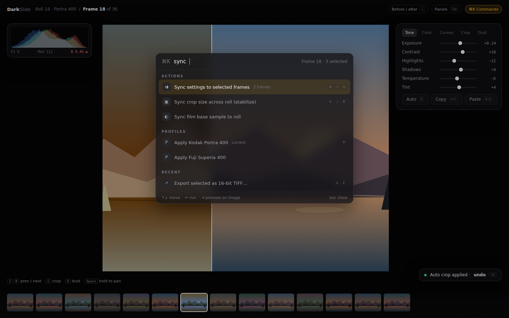

# DarkSlide UI redesign mockups

Three alternative directions for a full redesign of the editor. They are static HTML mockups (open any `.html` file in a browser at 1440×900) to compare layouts and flow. They are not implementations, and the placeholder photograph is drawn in SVG.

They respond to tdurieux's editor redesign (tool rail, filmstrip, bottom toolbar) and to how DarkSlide is actually used: converting a **whole roll**, not single images.

## Where the current flow gets in the way

- **One tab per image.** A 36-frame roll becomes 36 browser-style tabs. Navigating frames, seeing which ones are done, and selecting several at once are all awkward.
- **Controls in three places.** Adjust/Curves/Crop/Dust/Export are tabs in the left sidebar, film profiles live in a separate right panel, and the roll actions (sync settings, film base, stabilize crops) are buried in the roll card of that right panel.
- **No sense of progress.** Nothing shows which frames have a film base, a conversion, a crop or dust cleanup, so it is easy to export a frame that still needs work.
- **Roll actions are all-or-nothing.** Sync applies to the whole roll, without a "these three frames" or "only unedited frames" option.

## 1. Roll Darkroom: a guided workflow

[`1-roll-darkroom.html`](1-roll-darkroom.html)

The roll is the document. A stepper across the top follows the real order of the work: **Import → Film base → Convert → Frame → Clean → Export**. Each stage shows only its own tools in the right panel and reports progress across the roll (`11/36 converted`).

- **Filmstrip:** a vertical strip on the left with per-frame status tags (`BASE`, `CONV`, `CROP?`).
- **Apply to:** a scope control in every stage chooses *this frame*, *unedited frames* or the *whole roll*, replacing the separate sync actions.
- **Next stage:** a button moves on when the stage is done. The canvas toolbar switches Converted / Split / Negative.

**Best for:** people converting full rolls with a repeatable routine, and new users who need to learn the order of operations.
**Trade-off:** more structure. Jumping between stages to fix one frame must stay one click away.

## 2. Rail & Inspector: refined professional layout

[`2-rail-inspector.html`](2-rail-inspector.html)

The closest to tdurieux's direction.

- **Icon rail:** Develop, Color, Curves, Profiles, Crop, Dust, then Roll and Export. Each tool has a single-key shortcut, and the rail drives **one inspector** panel, so controls never live in two side panels.
- **Develop:** the histogram is docked at the top. Film profile, film base, tone and white balance each sit in a section that can be switched off to compare.
- **Recent profiles:** shown as chips, so switching stock does not open the full browser.
- **Bottom filmstrip:** replaces tabs and supports **multi-selection**. A contextual bar appears for the selection: *Sync settings*, *Stabilize crops*, *Auto dust*, *Export 3*. Status dots show base, edited and needs-crop.
- **Floating canvas toolbar:** groups the compare modes (converted, split, side by side), rotate/crop and zoom.

**Best for:** users coming from Lightroom or Capture One, and mixed single-image and roll work.
**Trade-off:** the biggest structural change to the existing components, close to the scope of the fork's redesign.

## 3. Focus Canvas: keyboard-first

[`3-focus-canvas.html`](3-focus-canvas.html)

The image takes the whole window. Chrome is reduced to floating glass panels that can be hidden with `Tab`:

- **Histogram:** a small heads-up display.
- **Adjustments:** a dock whose tabs replace the sidebar tabs.
- **Filmstrip:** a thin strip that fades when not in use.

A **command palette** (`⌘K`) reaches every action by name, including roll actions, profiles and exports. Before/after is a draggable split directly on the image, and toasts confirm automatic actions with an inline undo.

**Best for:** fast, experienced users and small laptop screens, where the photo matters more than permanent panels.
**Trade-off:** features are less discoverable; it relies on the palette and shortcuts being well known.

## Comparison

| | Roll Darkroom | Rail & Inspector | Focus Canvas |
|---|---|---|---|
| Unit of work | Roll, by stage | Frame, with roll selection | Frame |
| Frame navigation | Vertical strip with status | Bottom strip with multi-select | Thin auto-hiding strip, `J`/`K` |
| Where roll actions live | "Apply to" in every stage | Selection bar on the filmstrip | Command palette |
| Progress tracking | Per stage and per frame | Status dots | None by default |
| Space for the image | Medium | Medium | Maximum |
| Learning curve | Lowest | Familiar to pro users | Highest |
| Implementation effort | High (new flow model) | High (layout rewrite) | Medium (overlays on the current canvas) |

The ideas are not exclusive. For example, the Rail & Inspector layout could add Roll Darkroom's status tags and "Apply to" scope, plus the Focus Canvas command palette.

## Editing the mockups

The pages share `shared.css` and are otherwise self-contained; open them directly from disk. The screenshots in `screenshots/` were captured at 1440×900 with headless Chromium.
